# M2.2 — Database Design

> **Scope:** This document defines the **complete database schema for Nexus Anime** as delivered under Milestone 2 (Database & Backend Foundation). It covers all entities, relationships, constraints, indexes, and the ER diagram for the PostgreSQL 16 database managed via Drizzle ORM.

> **Status:** Draft — Pending Review
> **Date:** 2026-06-23
> **Author:** Tech Lead
> **Milestone:** M2 (Sprints 2–3)

---

## Table of Contents

1. [Design Principles](#1-design-principles)
2. [Entity-Relationship Diagram](#2-entity-relationship-diagram)
3. [Entity Definitions](#3-entity-definitions)
   - [3.1 Users & Profiles](#31-users--profiles)
   - [3.2 Content: Anime, Episodes, Seasons](#33-content-anime-episodes-seasons)
   - [3.3 Taxonomy: Genres, Studios](#33-taxonomy-genres-studios)
   - [3.4 Engagement: WatchHistory, Watchlists, Favorites](#34-engagement-watchhistory-watchlists-favorites)
   - [3.5 Social: Reviews, Ratings, Comments](#35-social-reviews-ratings-comments)
   - [3.6 System: Notifications, Subscriptions, UserPreferences](#36-system-notifications-subscriptions-userpreferences)
   - [3.7 Curation: Shelves, ShelfItems](#37-curation-shelves-shelfitems)
   - [3.8 Media: StreamAssets](#38-media-streamassets)
4. [Relationships Matrix](#4-relationships-matrix)
5. [Index Strategy](#5-index-strategy)
6. [Migration Plan](#6-migration-plan)
7. [Seed Data](#7-seed-data)
8. [Normalization Analysis](#8-normalization-analysis)
9. [Future Considerations](#9-future-considerations)

---

## 1. Design Principles

| Principle | Decision |
|-----------|----------|
| **Primary keys** | UUID v4 (`gen_random_uuid()`) on all tables — safe for distributed systems, no sequential enumeration |
| **Timestamps** | `created_at` and `updated_at` with `DEFAULT now()` on every table; `updated_at` updated via trigger |
| **Soft delete** | `deleted_at` timestamp (nullable) on user-facing content tables (`anime`, `episodes`, `seasons`, `reviews`, `comments`) |
| **Naming** | Snake_case for columns; singular table names (`anime`, not `animes`); junction tables as `entity1_entity2` |
| **Cascading** | `ON DELETE CASCADE` for dependent child rows (episodes → seasons); `ON DELETE SET NULL` for optional references |
| **Constraints** | `NOT NULL` by default; nullable only when business logic allows missing data |
| **Text search** | PostgreSQL `tsvector` column with GIN index on `anime` for MVP full-text search |
| **Enum handling** | PostgreSQL `ENUM` types for stable, constrained value sets; CHECK constraints for simple alternatives |

---

## 2. Entity-Relationship Diagram

```mermaid
erDiagram
    %% ── Core Identity ──────────────────────────────────
    users {
        uuid id PK
        varchar email UK
        varchar name
        varchar image
        varchar hashed_password
        enum role "user|admin|superadmin"
        timestamp email_verified
        timestamp created_at
        timestamp updated_at
    }

    user_profiles {
        uuid id PK
        uuid user_id FK
        text bio
        varchar avatar_url
        varchar website
        varchar location
        date date_of_birth
        jsonb social_links
        timestamp created_at
        timestamp updated_at
    }

    %% ── Content Hierarchy ──────────────────────────────
    anime {
        uuid id PK
        varchar slug UK
        varchar title
        varchar title_jp
        text synopsis
        varchar cover_image_url
        varchar banner_image_url
        enum type "TV|OVA|ONA|Movie|Special"
        enum status "airing|finished|upcoming"
        integer total_episodes
        integer duration_minutes
        date start_date
        date end_date
        decimal score
        integer popularity_rank
        uuid studio_id FK
        tsvector search_vector
        timestamp created_at
        timestamp updated_at
        timestamp deleted_at
    }

    seasons {
        uuid id PK
        uuid anime_id FK
        integer season_number
        varchar title
        text synopsis
        date start_date
        date end_date
        timestamp created_at
        timestamp updated_at
        timestamp deleted_at
    }

    episodes {
        uuid id PK
        uuid season_id FK
        integer episode_number
        varchar title
        text synopsis
        integer duration_seconds
        date air_date
        boolean is_filler
        varchar thumbnail_url
        timestamp created_at
        timestamp updated_at
        timestamp deleted_at
    }

    stream_assets {
        uuid id PK
        uuid episode_id FK
        varchar manifest_url
        varchar subtitle_url
        integer bitrate
        varchar resolution
        varchar codec
        integer file_size_bytes
        timestamp expires_at
        timestamp created_at
        timestamp updated_at
    }

    %% ── Taxonomy ───────────────────────────────────────
    genres {
        uuid id PK
        varchar slug UK
        varchar name
        text description
        varchar icon_url
        timestamp created_at
        timestamp updated_at
    }

    studios {
        uuid id PK
        varchar slug UK
        varchar name
        text description
        varchar logo_url
        varchar website
        date founded_date
        timestamp created_at
        timestamp updated_at
    }

    anime_genres {
        uuid anime_id FK
        uuid genre_id FK
    }

    %% ── Engagement ─────────────────────────────────────
    watch_history {
        uuid id PK
        uuid user_id FK
        uuid episode_id FK
        integer position_seconds
        integer duration_seconds
        decimal completion_pct
        timestamp watched_at
        timestamp created_at
        timestamp updated_at
    }

    watchlists {
        uuid id PK
        uuid user_id FK
        uuid anime_id FK
        enum status "plan_to_watch|watching|completed|dropped|on_hold"
        integer episodes_watched
        integer priority
        text notes
        timestamp created_at
        timestamp updated_at
    }

    favorites {
        uuid id PK
        uuid user_id FK
        uuid anime_id FK
        timestamp created_at
    }

    %% ── Social ─────────────────────────────────────────
    reviews {
        uuid id PK
        uuid user_id FK
        uuid anime_id FK
        varchar title
        text body
        boolean is_spoiler
        integer helpful_count
        enum status "published|draft|hidden"
        timestamp created_at
        timestamp updated_at
        timestamp deleted_at
    }

    ratings {
        uuid id PK
        uuid user_id FK
        uuid anime_id FK
        smallint score
        timestamp created_at
        timestamp updated_at
    }

    comments {
        uuid id PK
        uuid user_id FK
        uuid review_id FK
        uuid parent_comment_id FK
        text body
        integer likes_count
        timestamp created_at
        timestamp updated_at
        timestamp deleted_at
    }

    %% ── System ─────────────────────────────────────────
    subscriptions {
        uuid id PK
        uuid user_id FK
        varchar stripe_customer_id UK
        varchar stripe_subscription_id UK
        enum status "active|past_due|canceled|unpaid|trialing"
        timestamp current_period_start
        timestamp current_period_end
        boolean cancel_at_period_end
        timestamp created_at
        timestamp updated_at
    }

    user_preferences {
        uuid id PK
        uuid user_id FK
        varchar playback_quality "auto|360p|480p|720p|1080p"
        varchar subtitle_language
        boolean autoplay
        boolean skip_intro
        varchar theme "dark|light|system"
        varchar language
        timestamp created_at
        timestamp updated_at
    }

    notifications {
        uuid id PK
        uuid user_id FK
        varchar title
        text body
        enum type "system|episode|social|promo"
        boolean is_read
        varchar action_url
        timestamp created_at
        timestamp updated_at
    }

    %% ── Curation ───────────────────────────────────────
    shelves {
        uuid id PK
        varchar key UK
        varchar name
        text description
        varchar icon_url
        integer sort_order
        boolean is_active
        timestamp created_at
        timestamp updated_at
    }

    shelf_items {
        uuid id PK
        uuid shelf_id FK
        uuid anime_id FK
        integer position
        timestamp created_at
        timestamp updated_at
    }

    %% ── Relationships ──────────────────────────────────
    users ||--o| user_profiles : "has one"
    users ||--o| subscriptions : "has one active"
    users ||--o| user_preferences : "has one"
    users ||--o{ watch_history : "has many"
    users ||--o{ watchlists : "has many"
    users ||--o{ favorites : "has many"
    users ||--o{ reviews : "writes"
    users ||--o{ ratings : "gives"
    users ||--o{ comments : "posts"
    users ||--o{ notifications : "receives"

    anime ||--o{ seasons : "has many"
    anime ||--o{ anime_genres : "has many"
    anime ||--o{ watchlists : "tracked in"
    anime ||--o{ favorites : "favorited in"
    anime ||--o{ reviews : "reviewed in"
    anime ||--o{ ratings : "rated in"
    anime ||--o{ shelf_items : "featured in"
    anime }o--|| studios : "produced by"

    seasons ||--o{ episodes : "contains"
    episodes ||--o{ stream_assets : "has"
    episodes ||--o{ watch_history : "watched in"

    genres ||--o{ anime_genres : "categorizes"

    reviews ||--o{ comments : "has"
    comments ||--o{ comments : "replies to"

    shelves ||--o{ shelf_items : "contains"
```



---

## 3. Entity Definitions

### 3.1 Users & Profiles

#### `users`

The core identity table. Authentication is managed by Auth.js v5; this table stores the canonical user record.

| Column | Type | Constraints | Description |
|--------|------|-------------|-------------|
| `id` | `uuid` | `PRIMARY KEY DEFAULT gen_random_uuid()` | Unique identifier |
| `email` | `varchar(255)` | `UNIQUE NOT NULL` | User email (login credential) |
| `name` | `varchar(255)` | `NOT NULL DEFAULT ''` | Display name |
| `image` | `varchar(1024)` | | Avatar URL |
| `hashed_password` | `varchar(255)` | | Bcrypt hash (null for OAuth-only users) |
| `role` | `user_role` | `NOT NULL DEFAULT 'user'` | RBAC: `user`, `admin`, `superadmin` |
| `email_verified` | `timestamptz` | | Set on email verification |
| `created_at` | `timestamptz` | `NOT NULL DEFAULT now()` | Record creation |
| `updated_at` | `timestamptz` | `NOT NULL DEFAULT now()` | Last modification |

```sql
CREATE TYPE user_role AS ENUM ('user', 'admin', 'superadmin');

CREATE TABLE users (
    id uuid PRIMARY KEY DEFAULT gen_random_uuid(),
    email varchar(255) UNIQUE NOT NULL,
    name varchar(255) NOT NULL DEFAULT '',
    image varchar(1024),
    hashed_password varchar(255),
    role user_role NOT NULL DEFAULT 'user',
    email_verified timestamptz,
    created_at timestamptz NOT NULL DEFAULT now(),
    updated_at timestamptz NOT NULL DEFAULT now()
);
```

#### `user_profiles`

Extended profile data separated from `users` to keep the auth table lean. One-to-one with `users`.

| Column | Type | Constraints | Description |
|--------|------|-------------|-------------|
| `id` | `uuid` | `PRIMARY KEY DEFAULT gen_random_uuid()` | Unique identifier |
| `user_id` | `uuid` | `UNIQUE NOT NULL REFERENCES users(id) ON DELETE CASCADE` | Owner |
| `bio` | `text` | | Short biography |
| `avatar_url` | `varchar(1024)` | | Custom avatar (overrides `users.image`) |
| `website` | `varchar(500)` | | Personal website URL |
| `location` | `varchar(255)` | | Free-text location |
| `date_of_birth` | `date` | | Birth date (age-gating) |
| `social_links` | `jsonb` | | `{twitter, discord, ...}` |
| `created_at` | `timestamptz` | `NOT NULL DEFAULT now()` | Record creation |
| `updated_at` | `timestamptz` | `NOT NULL DEFAULT now()` | Last modification |

```sql
CREATE TABLE user_profiles (
    id uuid PRIMARY KEY DEFAULT gen_random_uuid(),
    user_id uuid UNIQUE NOT NULL REFERENCES users(id) ON DELETE CASCADE,
    bio text,
    avatar_url varchar(1024),
    website varchar(500),
    location varchar(255),
    date_of_birth date,
    social_links jsonb,
    created_at timestamptz NOT NULL DEFAULT now(),
    updated_at timestamptz NOT NULL DEFAULT now()
);
```

---

### 3.2 Content: Anime, Episodes, Seasons

#### `anime`

The central content entity. Stores all metadata for a title. Supports soft delete and full-text search.

| Column | Type | Constraints | Description |
|--------|------|-------------|-------------|
| `id` | `uuid` | `PRIMARY KEY DEFAULT gen_random_uuid()` | Unique identifier |
| `slug` | `varchar(255)` | `UNIQUE NOT NULL` | URL-friendly identifier |
| `title` | `varchar(500)` | `NOT NULL` | Romaji/English title |
| `title_jp` | `varchar(500)` | | Japanese title |
| `synopsis` | `text` | | Plot summary |
| `cover_image_url` | `varchar(1024)` | | Poster image (2:3 ratio) |
| `banner_image_url` | `varchar(1024)` | | Hero banner (21:9 ratio) |
| `type` | `anime_type` | | `TV`, `OVA`, `ONA`, `Movie`, `Special` |
| `status` | `anime_status` | | `airing`, `finished`, `upcoming` |
| `total_episodes` | `integer` | `CHECK (total_episodes >= 0)` | Expected episode count |
| `duration_minutes` | `integer` | | Average episode duration |
| `start_date` | `date` | | First air date |
| `end_date` | `date` | | Final air date |
| `score` | `decimal(4,2)` | `CHECK (score >= 0 AND score <= 10)` | Aggregate rating |
| `popularity_rank` | `integer` | | Computed popularity |
| `studio_id` | `uuid` | `REFERENCES studios(id) ON DELETE SET NULL` | Primary studio |
| `search_vector` | `tsvector` | | FTS index column |
| `created_at` | `timestamptz` | `NOT NULL DEFAULT now()` | Record creation |
| `updated_at` | `timestamptz` | `NOT NULL DEFAULT now()` | Last modification |
| `deleted_at` | `timestamptz` | | Soft delete marker |

```sql
CREATE TYPE anime_type AS ENUM ('TV', 'OVA', 'ONA', 'Movie', 'Special');
CREATE TYPE anime_status AS ENUM ('airing', 'finished', 'upcoming');

CREATE TABLE anime (
    id uuid PRIMARY KEY DEFAULT gen_random_uuid(),
    slug varchar(255) UNIQUE NOT NULL,
    title varchar(500) NOT NULL,
    title_jp varchar(500),
    synopsis text,
    cover_image_url varchar(1024),
    banner_image_url varchar(1024),
    type anime_type,
    status anime_status,
    total_episodes integer CHECK (total_episodes >= 0),
    duration_minutes integer,
    start_date date,
    end_date date,
    score decimal(4,2) CHECK (score >= 0 AND score <= 10),
    popularity_rank integer,
    studio_id uuid REFERENCES studios(id) ON DELETE SET NULL,
    search_vector tsvector,
    created_at timestamptz NOT NULL DEFAULT now(),
    updated_at timestamptz NOT NULL DEFAULT now(),
    deleted_at timestamptz
);
```

#### `seasons`

Groups episodes within an anime. Most TV anime have one season; long-running or split-cour series have multiple.

| Column | Type | Constraints | Description |
|--------|------|-------------|-------------|
| `id` | `uuid` | `PRIMARY KEY DEFAULT gen_random_uuid()` | Unique identifier |
| `anime_id` | `uuid` | `NOT NULL REFERENCES anime(id) ON DELETE CASCADE` | Parent anime |
| `season_number` | `integer` | `NOT NULL CHECK (season_number >= 1)` | Sequential number |
| `title` | `varchar(500)` | | e.g., "Season 2", "Cour 1" |
| `synopsis` | `text` | | Season synopsis |
| `start_date` | `date` | | Season start |
| `end_date` | `date` | | Season end |
| `created_at` | `timestamptz` | `NOT NULL DEFAULT now()` | Record creation |
| `updated_at` | `timestamptz` | `NOT NULL DEFAULT now()` | Last modification |
| `deleted_at` | `timestamptz` | | Soft delete marker |

```sql
CREATE TABLE seasons (
    id uuid PRIMARY KEY DEFAULT gen_random_uuid(),
    anime_id uuid NOT NULL REFERENCES anime(id) ON DELETE CASCADE,
    season_number integer NOT NULL CHECK (season_number >= 1),
    title varchar(500),
    synopsis text,
    start_date date,
    end_date date,
    created_at timestamptz NOT NULL DEFAULT now(),
    updated_at timestamptz NOT NULL DEFAULT now(),
    deleted_at timestamptz,
    UNIQUE(anime_id, season_number)
);
```

#### `episodes`

Individual episodes within a season. Each episode maps to exactly one stream asset.

| Column | Type | Constraints | Description |
|--------|------|-------------|-------------|
| `id` | `uuid` | `PRIMARY KEY DEFAULT gen_random_uuid()` | Unique identifier |
| `season_id` | `uuid` | `NOT NULL REFERENCES seasons(id) ON DELETE CASCADE` | Parent season |
| `episode_number` | `integer` | `NOT NULL CHECK (episode_number >= 0)` | Sequential number (0 = preview) |
| `title` | `varchar(500)` | | Episode title |
| `synopsis` | `text` | | Episode synopsis |
| `duration_seconds` | `integer` | | Runtime in seconds |
| `air_date` | `date` | | Original air date |
| `is_filler` | `boolean` | `NOT NULL DEFAULT false` | Filler/recap flag |
| `thumbnail_url` | `varchar(1024)` | | Episode thumbnail |
| `created_at` | `timestamptz` | `NOT NULL DEFAULT now()` | Record creation |
| `updated_at` | `timestamptz` | `NOT NULL DEFAULT now()` | Last modification |
| `deleted_at` | `timestamptz` | | Soft delete marker |

```sql
CREATE TABLE episodes (
    id uuid PRIMARY KEY DEFAULT gen_random_uuid(),
    season_id uuid NOT NULL REFERENCES seasons(id) ON DELETE CASCADE,
    episode_number integer NOT NULL CHECK (episode_number >= 0),
    title varchar(500),
    synopsis text,
    duration_seconds integer,
    air_date date,
    is_filler boolean NOT NULL DEFAULT false,
    thumbnail_url varchar(1024),
    created_at timestamptz NOT NULL DEFAULT now(),
    updated_at timestamptz NOT NULL DEFAULT now(),
    deleted_at timestamptz,
    UNIQUE(season_id, episode_number)
);
```

---

### 3.3 Taxonomy: Genres, Studios

#### `genres`

Reference table for anime genres. Seeded with standard MyAnimeList/AniList genre taxonomy.

| Column | Type | Constraints | Description |
|--------|------|-------------|-------------|
| `id` | `uuid` | `PRIMARY KEY DEFAULT gen_random_uuid()` | Unique identifier |
| `slug` | `varchar(100)` | `UNIQUE NOT NULL` | URL-friendly key |
| `name` | `varchar(255)` | `NOT NULL` | Display name |
| `description` | `text` | | Genre description |
| `icon_url` | `varchar(1024)` | | Optional icon |
| `created_at` | `timestamptz` | `NOT NULL DEFAULT now()` | Record creation |
| `updated_at` | `timestamptz` | `NOT NULL DEFAULT now()` | Last modification |

```sql
CREATE TABLE genres (
    id uuid PRIMARY KEY DEFAULT gen_random_uuid(),
    slug varchar(100) UNIQUE NOT NULL,
    name varchar(255) NOT NULL,
    description text,
    icon_url varchar(1024),
    created_at timestamptz NOT NULL DEFAULT now(),
    updated_at timestamptz NOT NULL DEFAULT now()
);
```

#### `studios`

Production studio reference table.

| Column | Type | Constraints | Description |
|--------|------|-------------|-------------|
| `id` | `uuid` | `PRIMARY KEY DEFAULT gen_random_uuid()` | Unique identifier |
| `slug` | `varchar(100)` | `UNIQUE NOT NULL` | URL-friendly key |
| `name` | `varchar(255)` | `NOT NULL` | Studio name |
| `description` | `text` | | Studio description |
| `logo_url` | `varchar(1024)` | | Studio logo |
| `website` | `varchar(500)` | | Official website |
| `founded_date` | `date` | | Founding date |
| `created_at` | `timestamptz` | `NOT NULL DEFAULT now()` | Record creation |
| `updated_at` | `timestamptz` | `NOT NULL DEFAULT now()` | Last modification |

```sql
CREATE TABLE studios (
    id uuid PRIMARY KEY DEFAULT gen_random_uuid(),
    slug varchar(100) UNIQUE NOT NULL,
    name varchar(255) NOT NULL,
    description text,
    logo_url varchar(1024),
    website varchar(500),
    founded_date date,
    created_at timestamptz NOT NULL DEFAULT now(),
    updated_at timestamptz NOT NULL DEFAULT now()
);
```

#### `anime_genres`

Junction table for the many-to-many relationship between anime and genres.

| Column | Type | Constraints | Description |
|--------|------|-------------|-------------|
| `anime_id` | `uuid` | `NOT NULL REFERENCES anime(id) ON DELETE CASCADE` | Anime reference |
| `genre_id` | `uuid` | `NOT NULL REFERENCES genres(id) ON DELETE CASCADE` | Genre reference |

```sql
CREATE TABLE anime_genres (
    anime_id uuid NOT NULL REFERENCES anime(id) ON DELETE CASCADE,
    genre_id uuid NOT NULL REFERENCES genres(id) ON DELETE CASCADE,
    PRIMARY KEY (anime_id, genre_id)
);
```

---

### 3.4 Engagement: WatchHistory, Watchlists, Favorites

#### `watch_history`

Tracks every episode watch event. Used for "continue watching" and analytics.

| Column | Type | Constraints | Description |
|--------|------|-------------|-------------|
| `id` | `uuid` | `PRIMARY KEY DEFAULT gen_random_uuid()` | Unique identifier |
| `user_id` | `uuid` | `NOT NULL REFERENCES users(id) ON DELETE CASCADE` | Watcher |
| `episode_id` | `uuid` | `NOT NULL REFERENCES episodes(id) ON DELETE CASCADE` | Watched episode |
| `position_seconds` | `integer` | `NOT NULL DEFAULT 0` | Last playback position |
| `duration_seconds` | `integer` | | Total episode duration |
| `completion_pct` | `decimal(5,2)` | `CHECK (completion_pct >= 0 AND completion_pct <= 100)` | Watch percentage |
| `watched_at` | `timestamptz` | `NOT NULL DEFAULT now()` | When watched |
| `created_at` | `timestamptz` | `NOT NULL DEFAULT now()` | Record creation |
| `updated_at` | `timestamptz` | `NOT NULL DEFAULT now()` | Last modification |

```sql
CREATE TABLE watch_history (
    id uuid PRIMARY KEY DEFAULT gen_random_uuid(),
    user_id uuid NOT NULL REFERENCES users(id) ON DELETE CASCADE,
    episode_id uuid NOT NULL REFERENCES episodes(id) ON DELETE CASCADE,
    position_seconds integer NOT NULL DEFAULT 0,
    duration_seconds integer,
    completion_pct decimal(5,2) CHECK (completion_pct >= 0 AND completion_pct <= 100),
    watched_at timestamptz NOT NULL DEFAULT now(),
    created_at timestamptz NOT NULL DEFAULT now(),
    updated_at timestamptz NOT NULL DEFAULT now()
);
```

#### `watchlists`

User's anime tracking list with status (plan to watch, watching, completed, etc.).

| Column | Type | Constraints | Description |
|--------|------|-------------|-------------|
| `id` | `uuid` | `PRIMARY KEY DEFAULT gen_random_uuid()` | Unique identifier |
| `user_id` | `uuid` | `NOT NULL REFERENCES users(id) ON DELETE CASCADE` | Owner |
| `anime_id` | `uuid` | `NOT NULL REFERENCES anime(id) ON DELETE CASCADE` | Tracked anime |
| `status` | `watchlist_status` | `NOT NULL DEFAULT 'plan_to_watch'` | Watch status |
| `episodes_watched` | `integer` | `NOT NULL DEFAULT 0 CHECK (episodes_watched >= 0)` | Progress count |
| `priority` | `integer` | `NOT NULL DEFAULT 0` | User priority (0=normal, 1=high) |
| `notes` | `text` | | Personal notes |
| `created_at` | `timestamptz` | `NOT NULL DEFAULT now()` | Record creation |
| `updated_at` | `timestamptz` | `NOT NULL DEFAULT now()` | Last modification |

```sql
CREATE TYPE watchlist_status AS ENUM ('plan_to_watch', 'watching', 'completed', 'dropped', 'on_hold');

CREATE TABLE watchlists (
    id uuid PRIMARY KEY DEFAULT gen_random_uuid(),
    user_id uuid NOT NULL REFERENCES users(id) ON DELETE CASCADE,
    anime_id uuid NOT NULL REFERENCES anime(id) ON DELETE CASCADE,
    status watchlist_status NOT NULL DEFAULT 'plan_to_watch',
    episodes_watched integer NOT NULL DEFAULT 0 CHECK (episodes_watched >= 0),
    priority integer NOT NULL DEFAULT 0,
    notes text,
    created_at timestamptz NOT NULL DEFAULT now(),
    updated_at timestamptz NOT NULL DEFAULT now(),
    UNIQUE(user_id, anime_id)
);
```

#### `favorites`

Simple bookmark for favorite anime. Separate from watchlists for quick access.

| Column | Type | Constraints | Description |
|--------|------|-------------|-------------|
| `id` | `uuid` | `PRIMARY KEY DEFAULT gen_random_uuid()` | Unique identifier |
| `user_id` | `uuid` | `NOT NULL REFERENCES users(id) ON DELETE CASCADE` | Owner |
| `anime_id` | `uuid` | `NOT NULL REFERENCES anime(id) ON DELETE CASCADE` | Favorited anime |
| `created_at` | `timestamptz` | `NOT NULL DEFAULT now()` | When favorited |

```sql
CREATE TABLE favorites (
    id uuid PRIMARY KEY DEFAULT gen_random_uuid(),
    user_id uuid NOT NULL REFERENCES users(id) ON DELETE CASCADE,
    anime_id uuid NOT NULL REFERENCES anime(id) ON DELETE CASCADE,
    created_at timestamptz NOT NULL DEFAULT now(),
    UNIQUE(user_id, anime_id)
);
```

---

### 3.5 Social: Reviews, Ratings, Comments

#### `reviews`

User-written reviews for anime. Supports spoiler flagging and moderation.

| Column | Type | Constraints | Description |
|--------|------|-------------|-------------|
| `id` | `uuid` | `PRIMARY KEY DEFAULT gen_random_uuid()` | Unique identifier |
| `user_id` | `uuid` | `NOT NULL REFERENCES users(id) ON DELETE CASCADE` | Author |
| `anime_id` | `uuid` | `NOT NULL REFERENCES anime(id) ON DELETE CASCADE` | Reviewed anime |
| `title` | `varchar(500)` | | Review title |
| `body` | `text` | `NOT NULL` | Review content |
| `is_spoiler` | `boolean` | `NOT NULL DEFAULT false` | Spoiler warning |
| `helpful_count` | `integer` | `NOT NULL DEFAULT 0` | Upvote count |
| `status` | `review_status` | `NOT NULL DEFAULT 'published'` | Moderation status |
| `created_at` | `timestamptz` | `NOT NULL DEFAULT now()` | Record creation |
| `updated_at` | `timestamptz` | `NOT NULL DEFAULT now()` | Last modification |
| `deleted_at` | `timestamptz` | | Soft delete marker |

```sql
CREATE TYPE review_status AS ENUM ('published', 'draft', 'hidden');

CREATE TABLE reviews (
    id uuid PRIMARY KEY DEFAULT gen_random_uuid(),
    user_id uuid NOT NULL REFERENCES users(id) ON DELETE CASCADE,
    anime_id uuid NOT NULL REFERENCES anime(id) ON DELETE CASCADE,
    title varchar(500),
    body text NOT NULL,
    is_spoiler boolean NOT NULL DEFAULT false,
    helpful_count integer NOT NULL DEFAULT 0,
    status review_status NOT NULL DEFAULT 'published',
    created_at timestamptz NOT NULL DEFAULT now(),
    updated_at timestamptz NOT NULL DEFAULT now(),
    deleted_at timestamptz,
    UNIQUE(user_id, anime_id)
);
```

#### `ratings`

Numeric score (1-10) per user per anime. One rating per user per anime.

| Column | Type | Constraints | Description |
|--------|------|-------------|-------------|
| `id` | `uuid` | `PRIMARY KEY DEFAULT gen_random_uuid()` | Unique identifier |
| `user_id` | `uuid` | `NOT NULL REFERENCES users(id) ON DELETE CASCADE` | Rater |
| `anime_id` | `uuid` | `NOT NULL REFERENCES anime(id) ON DELETE CASCADE` | Rated anime |
| `score` | `smallint` | `NOT NULL CHECK (score >= 1 AND score <= 10)` | Rating value |
| `created_at` | `timestamptz` | `NOT NULL DEFAULT now()` | Record creation |
| `updated_at` | `timestamptz` | `NOT NULL DEFAULT now()` | Last modification |

```sql
CREATE TABLE ratings (
    id uuid PRIMARY KEY DEFAULT gen_random_uuid(),
    user_id uuid NOT NULL REFERENCES users(id) ON DELETE CASCADE,
    anime_id uuid NOT NULL REFERENCES anime(id) ON DELETE CASCADE,
    score smallint NOT NULL CHECK (score >= 1 AND score <= 10),
    created_at timestamptz NOT NULL DEFAULT now(),
    updated_at timestamptz NOT NULL DEFAULT now(),
    UNIQUE(user_id, anime_id)
);
```

#### `comments`

Threaded comments on reviews. Supports nested replies via `parent_comment_id`.

| Column | Type | Constraints | Description |
|--------|------|-------------|-------------|
| `id` | `uuid` | `PRIMARY KEY DEFAULT gen_random_uuid()` | Unique identifier |
| `user_id` | `uuid` | `NOT NULL REFERENCES users(id) ON DELETE CASCADE` | Author |
| `review_id` | `uuid` | `NOT NULL REFERENCES reviews(id) ON DELETE CASCADE` | Parent review |
| `parent_comment_id` | `uuid` | `REFERENCES comments(id) ON DELETE CASCADE` | For nested replies |
| `body` | `text` | `NOT NULL` | Comment content |
| `likes_count` | `integer` | `NOT NULL DEFAULT 0` | Like count |
| `created_at` | `timestamptz` | `NOT NULL DEFAULT now()` | Record creation |
| `updated_at` | `timestamptz` | `NOT NULL DEFAULT now()` | Last modification |
| `deleted_at` | `timestamptz` | | Soft delete marker |

```sql
CREATE TABLE comments (
    id uuid PRIMARY KEY DEFAULT gen_random_uuid(),
    user_id uuid NOT NULL REFERENCES users(id) ON DELETE CASCADE,
    review_id uuid NOT NULL REFERENCES reviews(id) ON DELETE CASCADE,
    parent_comment_id uuid REFERENCES comments(id) ON DELETE CASCADE,
    body text NOT NULL,
    likes_count integer NOT NULL DEFAULT 0,
    created_at timestamptz NOT NULL DEFAULT now(),
    updated_at timestamptz NOT NULL DEFAULT now(),
    deleted_at timestamptz
);
```

---

### 3.6 System: Notifications, Subscriptions, UserPreferences

#### `subscriptions`

Stripe subscription tracking. One active subscription per user.

| Column | Type | Constraints | Description |
|--------|------|-------------|-------------|
| `id` | `uuid` | `PRIMARY KEY DEFAULT gen_random_uuid()` | Unique identifier |
| `user_id` | `uuid` | `NOT NULL REFERENCES users(id) ON DELETE CASCADE` | Subscriber |
| `stripe_customer_id` | `varchar(255)` | `UNIQUE NOT NULL` | Stripe customer ID |
| `stripe_subscription_id` | `varchar(255)` | `UNIQUE` | Stripe subscription ID |
| `status` | `subscription_status` | `NOT NULL DEFAULT 'trialing'` | Subscription state |
| `current_period_start` | `timestamptz` | | Billing period start |
| `current_period_end` | `timestamptz` | | Billing period end |
| `cancel_at_period_end` | `boolean` | `NOT NULL DEFAULT false` | Pending cancellation |
| `created_at` | `timestamptz` | `NOT NULL DEFAULT now()` | Record creation |
| `updated_at` | `timestamptz` | `NOT NULL DEFAULT now()` | Last modification |

```sql
CREATE TYPE subscription_status AS ENUM ('active', 'past_due', 'canceled', 'unpaid', 'trialing');

CREATE TABLE subscriptions (
    id uuid PRIMARY KEY DEFAULT gen_random_uuid(),
    user_id uuid NOT NULL REFERENCES users(id) ON DELETE CASCADE,
    stripe_customer_id varchar(255) UNIQUE NOT NULL,
    stripe_subscription_id varchar(255) UNIQUE,
    status subscription_status NOT NULL DEFAULT 'trialing',
    current_period_start timestamptz,
    current_period_end timestamptz,
    cancel_at_period_end boolean NOT NULL DEFAULT false,
    created_at timestamptz NOT NULL DEFAULT now(),
    updated_at timestamptz NOT NULL DEFAULT now()
);
```

#### `user_preferences`

Per-user application preferences. One-to-one with `users`.

| Column | Type | Constraints | Description |
|--------|------|-------------|-------------|
| `id` | `uuid` | `PRIMARY KEY DEFAULT gen_random_uuid()` | Unique identifier |
| `user_id` | `uuid` | `UNIQUE NOT NULL REFERENCES users(id) ON DELETE CASCADE` | Owner |
| `playback_quality` | `varchar(20)` | `NOT NULL DEFAULT 'auto'` | Preferred quality |
| `subtitle_language` | `varchar(10)` | `DEFAULT 'en'` | Subtitle language code |
| `autoplay` | `boolean` | `NOT NULL DEFAULT true` | Auto-advance episodes |
| `skip_intro` | `boolean` | `NOT NULL DEFAULT false` | Auto-skip intro |
| `theme` | `varchar(20)` | `NOT NULL DEFAULT 'dark'` | UI theme |
| `language` | `varchar(10)` | `NOT NULL DEFAULT 'en'` | UI language |
| `created_at` | `timestamptz` | `NOT NULL DEFAULT now()` | Record creation |
| `updated_at` | `timestamptz` | `NOT NULL DEFAULT now()` | Last modification |

```sql
CREATE TABLE user_preferences (
    id uuid PRIMARY KEY DEFAULT gen_random_uuid(),
    user_id uuid UNIQUE NOT NULL REFERENCES users(id) ON DELETE CASCADE,
    playback_quality varchar(20) NOT NULL DEFAULT 'auto',
    subtitle_language varchar(10) DEFAULT 'en',
    autoplay boolean NOT NULL DEFAULT true,
    skip_intro boolean NOT NULL DEFAULT false,
    theme varchar(20) NOT NULL DEFAULT 'dark',
    language varchar(10) NOT NULL DEFAULT 'en',
    created_at timestamptz NOT NULL DEFAULT now(),
    updated_at timestamptz NOT NULL DEFAULT now()
);
```

#### `notifications`

In-app notification system for system alerts, new episodes, social activity, and promotions.

| Column | Type | Constraints | Description |
|--------|------|-------------|-------------|
| `id` | `uuid` | `PRIMARY KEY DEFAULT gen_random_uuid()` | Unique identifier |
| `user_id` | `uuid` | `NOT NULL REFERENCES users(id) ON DELETE CASCADE` | Recipient |
| `title` | `varchar(500)` | `NOT NULL` | Notification title |
| `body` | `text` | | Notification body |
| `type` | `notification_type` | `NOT NULL DEFAULT 'system'` | Category |
| `is_read` | `boolean` | `NOT NULL DEFAULT false` | Read status |
| `action_url` | `varchar(1024)` | | Deep link URL |
| `created_at` | `timestamptz` | `NOT NULL DEFAULT now()` | Record creation |
| `updated_at` | `timestamptz` | `NOT NULL DEFAULT now()` | Last modification |

```sql
CREATE TYPE notification_type AS ENUM ('system', 'episode', 'social', 'promo');

CREATE TABLE notifications (
    id uuid PRIMARY KEY DEFAULT gen_random_uuid(),
    user_id uuid NOT NULL REFERENCES users(id) ON DELETE CASCADE,
    title varchar(500) NOT NULL,
    body text,
    type notification_type NOT NULL DEFAULT 'system',
    is_read boolean NOT NULL DEFAULT false,
    action_url varchar(1024),
    created_at timestamptz NOT NULL DEFAULT now(),
    updated_at timestamptz NOT NULL DEFAULT now()
);
```

---

### 3.7 Curation: Shelves, ShelfItems

#### `shelves`

Curated content collections displayed on the home page and browse sections (e.g., "Trending Now", "New Releases", "Staff Picks").

| Column | Type | Constraints | Description |
|--------|------|-------------|-------------|
| `id` | `uuid` | `PRIMARY KEY DEFAULT gen_random_uuid()` | Unique identifier |
| `key` | `varchar(100)` | `UNIQUE NOT NULL` | Programmatic key (e.g., `trending`, `new_releases`) |
| `name` | `varchar(255)` | `NOT NULL` | Display name |
| `description` | `text` | | Shelf description |
| `icon_url` | `varchar(1024)` | | Optional icon |
| `sort_order` | `integer` | `NOT NULL DEFAULT 0` | Display ordering |
| `is_active` | `boolean` | `NOT NULL DEFAULT true` | Visibility toggle |
| `created_at` | `timestamptz` | `NOT NULL DEFAULT now()` | Record creation |
| `updated_at` | `timestamptz` | `NOT NULL DEFAULT now()` | Last modification |

```sql
CREATE TABLE shelves (
    id uuid PRIMARY KEY DEFAULT gen_random_uuid(),
    key varchar(100) UNIQUE NOT NULL,
    name varchar(255) NOT NULL,
    description text,
    icon_url varchar(1024),
    sort_order integer NOT NULL DEFAULT 0,
    is_active boolean NOT NULL DEFAULT true,
    created_at timestamptz NOT NULL DEFAULT now(),
    updated_at timestamptz NOT NULL DEFAULT now()
);
```

#### `shelf_items`

Ordered anime entries within a shelf.

| Column | Type | Constraints | Description |
|--------|------|-------------|-------------|
| `id` | `uuid` | `PRIMARY KEY DEFAULT gen_random_uuid()` | Unique identifier |
| `shelf_id` | `uuid` | `NOT NULL REFERENCES shelves(id) ON DELETE CASCADE` | Parent shelf |
| `anime_id` | `uuid` | `NOT NULL REFERENCES anime(id) ON DELETE CASCADE` | Featured anime |
| `position` | `integer` | `NOT NULL DEFAULT 0` | Display order |
| `created_at` | `timestamptz` | `NOT NULL DEFAULT now()` | Record creation |
| `updated_at` | `timestamptz` | `NOT NULL DEFAULT now()` | Last modification |

```sql
CREATE TABLE shelf_items (
    id uuid PRIMARY KEY DEFAULT gen_random_uuid(),
    shelf_id uuid NOT NULL REFERENCES shelves(id) ON DELETE CASCADE,
    anime_id uuid NOT NULL REFERENCES anime(id) ON DELETE CASCADE,
    position integer NOT NULL DEFAULT 0,
    created_at timestamptz NOT NULL DEFAULT now(),
    updated_at timestamptz NOT NULL DEFAULT now(),
    UNIQUE(shelf_id, anime_id)
);
```

---

### 3.8 Media: StreamAssets

#### `stream_assets`

Signed streaming URLs for episodes. URLs are generated on-demand via Cloudflare Stream and cached here with expiration.

| Column | Type | Constraints | Description |
|--------|------|-------------|-------------|
| `id` | `uuid` | `PRIMARY KEY DEFAULT gen_random_uuid()` | Unique identifier |
| `episode_id` | `uuid` | `NOT NULL REFERENCES episodes(id) ON DELETE CASCADE` | Parent episode |
| `manifest_url` | `varchar(2048)` | `NOT NULL` | HLS manifest URL (signed) |
| `subtitle_url` | `varchar(2048)` | | Subtitle file URL |
| `bitrate` | `integer` | | Bitrate in kbps |
| `resolution` | `varchar(20)` | | e.g., `1080p`, `720p` |
| `codec` | `varchar(50)` | | e.g., `h264`, `h265` |
| `file_size_bytes` | `bigint` | | File size |
| `expires_at` | `timestamptz` | `NOT NULL` | URL expiration |
| `created_at` | `timestamptz` | `NOT NULL DEFAULT now()` | Record creation |
| `updated_at` | `timestamptz` | `NOT NULL DEFAULT now()` | Last modification |

```sql
CREATE TABLE stream_assets (
    id uuid PRIMARY KEY DEFAULT gen_random_uuid(),
    episode_id uuid NOT NULL REFERENCES episodes(id) ON DELETE CASCADE,
    manifest_url varchar(2048) NOT NULL,
    subtitle_url varchar(2048),
    bitrate integer,
    resolution varchar(20),
    codec varchar(50),
    file_size_bytes bigint,
    expires_at timestamptz NOT NULL,
    created_at timestamptz NOT NULL DEFAULT now(),
    updated_at timestamptz NOT NULL DEFAULT now()
);
```

---

## 4. Relationships Matrix

| Parent | Child | Type | On Delete | FK Column |
|--------|-------|------|-----------|-----------|
| `users` | `user_profiles` | 1:1 | CASCADE | `user_profiles.user_id` |
| `users` | `subscriptions` | 1:1 | CASCADE | `subscriptions.user_id` |
| `users` | `user_preferences` | 1:1 | CASCADE | `user_preferences.user_id` |
| `users` | `watch_history` | 1:N | CASCADE | `watch_history.user_id` |
| `users` | `watchlists` | 1:N | CASCADE | `watchlists.user_id` |
| `users` | `favorites` | 1:N | CASCADE | `favorites.user_id` |
| `users` | `reviews` | 1:N | CASCADE | `reviews.user_id` |
| `users` | `ratings` | 1:N | CASCADE | `ratings.user_id` |
| `users` | `comments` | 1:N | CASCADE | `comments.user_id` |
| `users` | `notifications` | 1:N | CASCADE | `notifications.user_id` |
| `anime` | `seasons` | 1:N | CASCADE | `seasons.anime_id` |
| `anime` | `anime_genres` | M:N | CASCADE | `anime_genres.anime_id` |
| `anime` | `watchlists` | 1:N | CASCADE | `watchlists.anime_id` |
| `anime` | `favorites` | 1:N | CASCADE | `favorites.anime_id` |
| `anime` | `reviews` | 1:N | CASCADE | `reviews.anime_id` |
| `anime` | `ratings` | 1:N | CASCADE | `ratings.anime_id` |
| `anime` | `shelf_items` | 1:N | CASCADE | `shelf_items.anime_id` |
| `anime` | `studios` | N:1 | SET NULL | `anime.studio_id` |
| `seasons` | `episodes` | 1:N | CASCADE | `episodes.season_id` |
| `episodes` | `stream_assets` | 1:N | CASCADE | `stream_assets.episode_id` |
| `episodes` | `watch_history` | 1:N | CASCADE | `watch_history.episode_id` |
| `genres` | `anime_genres` | M:N | CASCADE | `anime_genres.genre_id` |
| `reviews` | `comments` | 1:N | CASCADE | `comments.review_id` |
| `comments` | `comments` | 1:N (self) | CASCADE | `comments.parent_comment_id` |
| `shelves` | `shelf_items` | 1:N | CASCADE | `shelf_items.shelf_id` |

---

## 5. Index Strategy

### Primary Indexes (auto-created with PKs)

All UUID primary keys get B-tree indexes automatically.

### Foreign Key Indexes

Every foreign key column gets a B-tree index for JOIN performance:

```sql
-- users
CREATE INDEX idx_users_email ON users(email);
CREATE INDEX idx_users_role ON users(role);

-- user_profiles
CREATE INDEX idx_user_profiles_user_id ON user_profiles(user_id);

-- anime
CREATE INDEX idx_anime_slug ON anime(slug);
CREATE INDEX idx_anime_studio_id ON anime(studio_id);
CREATE INDEX idx_anime_status ON anime(status);
CREATE INDEX idx_anime_type ON anime(type);
CREATE INDEX idx_anime_score ON anime(score DESC);
CREATE INDEX idx_anime_popularity ON anime(popularity_rank ASC);
CREATE INDEX idx_anime_deleted_at ON anime(deleted_at) WHERE deleted_at IS NULL;

-- Full-text search
CREATE INDEX idx_anime_search ON anime USING gin(search_vector);

-- seasons
CREATE INDEX idx_seasons_anime_id ON seasons(anime_id);

-- episodes
CREATE INDEX idx_episodes_season_id ON episodes(season_id);
CREATE INDEX idx_episodes_air_date ON episodes(air_date);

-- stream_assets
CREATE INDEX idx_stream_assets_episode_id ON stream_assets(episode_id);
CREATE INDEX idx_stream_assets_expires ON stream_assets(expires_at);

-- genres
CREATE INDEX idx_genres_slug ON genres(slug);

-- studios
CREATE INDEX idx_studios_slug ON studios(slug);

-- anime_genres
CREATE INDEX idx_anime_genres_genre_id ON anime_genres(genre_id);

-- watch_history
CREATE INDEX idx_watch_history_user_id ON watch_history(user_id);
CREATE INDEX idx_watch_history_episode_id ON watch_history(episode_id);
CREATE INDEX idx_watch_history_watched_at ON watch_history(watched_at DESC);
CREATE INDEX idx_watch_history_user_episode ON watch_history(user_id, episode_id);

-- watchlists
CREATE INDEX idx_watchlists_user_id ON watchlists(user_id);
CREATE INDEX idx_watchlists_anime_id ON watchlists(anime_id);
CREATE INDEX idx_watchlists_status ON watchlists(status);
CREATE INDEX idx_watchlists_user_status ON watchlists(user_id, status);

-- favorites
CREATE INDEX idx_favorites_user_id ON favorites(user_id);
CREATE INDEX idx_favorites_anime_id ON favorites(anime_id);

-- reviews
CREATE INDEX idx_reviews_user_id ON reviews(user_id);
CREATE INDEX idx_reviews_anime_id ON reviews(anime_id);
CREATE INDEX idx_reviews_status ON reviews(status);
CREATE INDEX idx_reviews_created_at ON reviews(created_at DESC);

-- ratings
CREATE INDEX idx_ratings_user_id ON ratings(user_id);
CREATE INDEX idx_ratings_anime_id ON ratings(anime_id);

-- comments
CREATE INDEX idx_comments_review_id ON comments(review_id);
CREATE INDEX idx_comments_parent_id ON comments(parent_comment_id) WHERE parent_comment_id IS NOT NULL;
CREATE INDEX idx_comments_user_id ON comments(user_id);

-- subscriptions
CREATE INDEX idx_subscriptions_user_id ON subscriptions(user_id);
CREATE INDEX idx_subscriptions_stripe_customer ON subscriptions(stripe_customer_id);
CREATE INDEX idx_subscriptions_stripe_sub ON subscriptions(stripe_subscription_id);
CREATE INDEX idx_subscriptions_status ON subscriptions(status);

-- notifications
CREATE INDEX idx_notifications_user_id ON notifications(user_id);
CREATE INDEX idx_notifications_user_unread ON notifications(user_id) WHERE is_read = false;
CREATE INDEX idx_notifications_created_at ON notifications(created_at DESC);

-- shelves
CREATE INDEX idx_shelves_key ON shelves(key);
CREATE INDEX idx_shelves_active ON shelves(is_active) WHERE is_active = true;

-- shelf_items
CREATE INDEX idx_shelf_items_shelf_id ON shelf_items(shelf_id);
CREATE INDEX idx_shelf_items_anime_id ON shelf_items(anime_id);
CREATE INDEX idx_shelf_items_position ON shelf_items(shelf_id, position);
```

### Index Rationale

| Index Pattern | Purpose |
|---------------|---------|
| `idx_anime_search` (GIN) | Full-text search on title + synopsis — powers `/api/v1/search` |
| `idx_watch_history_user_episode` | Unique-like lookup for "continue watching" — most frequent query |
| `idx_watchlists_user_status` | Filter user's watchlist by status (watching, completed, etc.) |
| `idx_notifications_user_unread` | Fast unread count for notification badge |
| `idx_shelf_items_position` | Ordered shelf retrieval for home page |
| `idx_anime_deleted_at` (partial) | Exclude soft-deleted rows from all queries |
| `idx_stream_assets_expires` | TTL cleanup job for expired signed URLs |

---

## 6. Migration Plan

### Migration Order

Migrations must run in dependency order (parents before children):

| Order | Migration | Tables Created | Depends On |
|-------|-----------|----------------|------------|
| 1 | `001_create_enum_types` | ENUM types (`user_role`, `anime_type`, `anime_status`, `watchlist_status`, `review_status`, `subscription_status`, `notification_type`) | — |
| 2 | `002_create_reference_tables` | `genres`, `studios`, `shelves` | Enum types |
| 3 | `003_create_users` | `users`, `user_profiles`, `user_preferences` | Enum types |
| 4 | `004_create_content` | `anime`, `seasons`, `episodes`, `stream_assets`, `anime_genres` | Enum types, reference tables, users |
| 5 | `005_create_engagement` | `watch_history`, `watchlists`, `favorites` | Users, anime, episodes |
| 6 | `006_create_social` | `reviews`, `ratings`, `comments` | Users, anime |
| 7 | `007_create_system` | `subscriptions`, `notifications` | Users, enum types |
| 8 | `008_create_curation` | `shelf_items` | Shelves, anime |
| 9 | `009_create_indexes` | All non-PK indexes | All tables |
| 10 | `010_create_triggers` | `updated_at` auto-update trigger, `search_vector` update trigger | All tables |

### Trigger: Auto-Update `updated_at`

```sql
CREATE OR REPLACE FUNCTION update_updated_at_column()
RETURNS TRIGGER AS $$
BEGIN
    NEW.updated_at = now();
    RETURN NEW;
END;
$$ language 'plpgsql';

-- Applied to every table with updated_at:
CREATE TRIGGER update_users_updated_at BEFORE UPDATE ON users
    FOR EACH ROW EXECUTE FUNCTION update_updated_at_column();
-- (repeat for all tables with updated_at)
```

### Trigger: Auto-Update `search_vector`

```sql
CREATE OR REPLACE FUNCTION anime_search_vector_update()
RETURNS TRIGGER AS $$
BEGIN
    NEW.search_vector =
        setweight(to_tsvector('english', COALESCE(NEW.title, '')), 'A') ||
        setweight(to_tsvector('english', COALESCE(NEW.title_jp, '')), 'B') ||
        setweight(to_tsvector('english', COALESCE(NEW.synopsis, '')), 'C');
    RETURN NEW;
END;
$$ LANGUAGE plpgsql;

CREATE TRIGGER anime_search_vector_trigger BEFORE INSERT OR UPDATE ON anime
    FOR EACH ROW EXECUTE FUNCTION anime_search_vector_update();
```

---

## 7. Seed Data

### Genres (17 standard genres)

| slug | name |
|------|------|
| `action` | Action |
| `adventure` | Adventure |
| `comedy` | Comedy |
| `drama` | Drama |
| `fantasy` | Fantasy |
| `horror` | Horror |
| `isekai` | Isekai |
| `mecha` | Mecha |
| `mystery` | Mystery |
| `psychological` | Psychological |
| `romance` | Romance |
| `sci-fi` | Sci-Fi |
| `slice-of-life` | Slice of Life |
| `sports` | Sports |
| `supernatural` | Supernatural |
| `thriller` | Thriller |
| `music` | Music |

### Shelves (5 default shelves)

| key | name | sort_order |
|-----|------|------------|
| `hero` | Featured Hero | 0 |
| `trending` | Trending Now | 1 |
| `new_releases` | New Releases | 2 |
| `top_rated` | Top Rated | 3 |
| `staff_picks` | Staff Picks | 4 |

### Studios (seed with major studios)

| slug | name |
|------|------|
| `kyoto-animation` | Kyoto Animation |
| `ufotable` | ufotable |
| `wit-studio` | WIT Studio |
| `mappa` | MAPPA |
| `bones` | Bones |
| `a-1-pictures` | A-1 Pictures |
| `trigger` | Studio Trigger |
| `madhouse` | Madhouse |
| `shaft` | SHAFT |
| `cloverworks` | CloverWorks |

---

## 8. Normalization Analysis

| Normal Form | Status | Notes |
|-------------|--------|-------|
| **1NF** | ✅ Compliant | All columns atomic; no repeating groups |
| **2NF** | ✅ Compliant | No partial dependencies (all PKs are single-column UUIDs) |
| **3NF** | ✅ Compliant | No transitive dependencies; `studio_id` references `studios` instead of embedding studio name |
| **BCNF** | ✅ Compliant | Every determinant is a candidate key |

### Intentional Denormalizations

| Field | Table | Rationale |
|-------|-------|-----------|
| `score` | `anime` | Aggregate of `ratings.score` — updated via trigger/materialized view to avoid expensive AVG on every read |
| `popularity_rank` | `anime` | Computed from watch_history + watchlist activity — updated by background job |
| `total_episodes` | `anime` | Cached count from `episodes` table — avoids COUNT(*) on large catalogs |
| `completion_pct` | `watch_history` | Derived from `position_seconds / duration_seconds` — stored for fast analytics queries |
| `helpful_count` | `reviews` | Aggregate of upvotes — updated via counter cache |
| `likes_count` | `comments` | Aggregate of likes — updated via counter cache |

---

## 9. Future Considerations

### Post-MVP Additions (not in M2 scope)

| Entity | Purpose | Sprint |
|--------|---------|--------|
| `tags` + `anime_tags` | Content tags (e.g., "Time Travel", "Post-Apocalyptic") — more granular than genres | S7+ |
| `characters` + `anime_characters` | Character database with VA credits | S8+ |
| `franchises` + `anime_franchises` | Group related titles (e.g., "Attack on Titan" franchise) | S8+ |
| `user_follows` | Social follow system between users | S11+ (Beta) |
| `watch_party` | Synchronized group viewing sessions | Q+3 |
| `audit_logs` | Admin action tracking for compliance | S8 |
| `episode_thumbnails` | Per-episode preview thumbnails (storyboard) | S6+ |

### Scaling Triggers

| Trigger | Action |
|---------|--------|
| 10K MAU | Enable Redis caching for shelf queries; materialized view for `anime.score` |
| 30K MAU | Partition `watch_history` by `watched_at` (monthly) |
| 100K MAU | Migrate search from PostgreSQL FTS to Meilisearch; add read replica |
| 300K MAU | Batch writes for `watch_progress` (debounce rapid updates) |
| 1M MAU | Evaluate table partitioning for `notifications`; archive old `watch_history` |

### Drizzle ORM Mapping

All tables above map directly to Drizzle schema files in `packages/db/src/schema/`:

```
packages/db/src/schema/
├── enums.ts              # Shared ENUM definitions
├── users.ts              # users, user_profiles, user_preferences
├── anime.ts              # anime, seasons, episodes, stream_assets
├── genres.ts             # genres, anime_genres
├── studios.ts            # studios
├── engagement.ts         # watch_history, watchlists, favorites
├── social.ts             # reviews, ratings, comments
├── system.ts             # subscriptions, notifications
├── curation.ts           # shelves, shelf_items
├── relations.ts          # Drizzle relations() definitions
└── index.ts              # Re-exports all schemas
```

---

## Appendix: Complete Table Summary

| # | Table | Purpose | Sprint | Rows (MVP) |
|---|-------|---------|--------|------------|
| 1 | `users` | Core identity | S4 | 100 |
| 2 | `user_profiles` | Extended profile | S4 | 100 |
| 3 | `user_preferences` | App preferences | S4 | 100 |
| 4 | `subscriptions` | Stripe billing | S5 | 50 |
| 5 | `anime` | Title metadata | S2 | 50–75 |
| 6 | `seasons` | Season grouping | S2 | 60 |
| 7 | `episodes` | Episode data | S2 | 200–400 |
| 8 | `stream_assets` | Signed URLs | S6 | 200–400 |
| 9 | `genres` | Genre taxonomy | S2 | 17 |
| 10 | `studios` | Studio reference | S2 | 10 |
| 11 | `anime_genres` | M:N junction | S2 | ~150 |
| 12 | `watch_history` | Watch tracking | S6 | Growing |
| 13 | `watchlists` | User tracking | S7 | ~300 |
| 14 | `favorites` | Quick bookmarks | S7 | ~200 |
| 15 | `reviews` | User reviews | S7+ | ~50 |
| 16 | `ratings` | Numeric scores | S7+ | ~200 |
| 17 | `comments` | Review comments | S7+ | ~100 |
| 18 | `notifications` | In-app alerts | S7+ | Growing |
| 19 | `shelves` | Curated shelves | S2 | 5 |
| 20 | `shelf_items` | Shelf contents | S2 | ~60 |

**Total: 20 tables, 7 ENUM types, ~50 indexes**

---

*This document is the authoritative reference for the Nexus Anime database schema. All Drizzle schema definitions, migrations, and seed scripts must conform to this specification.*
